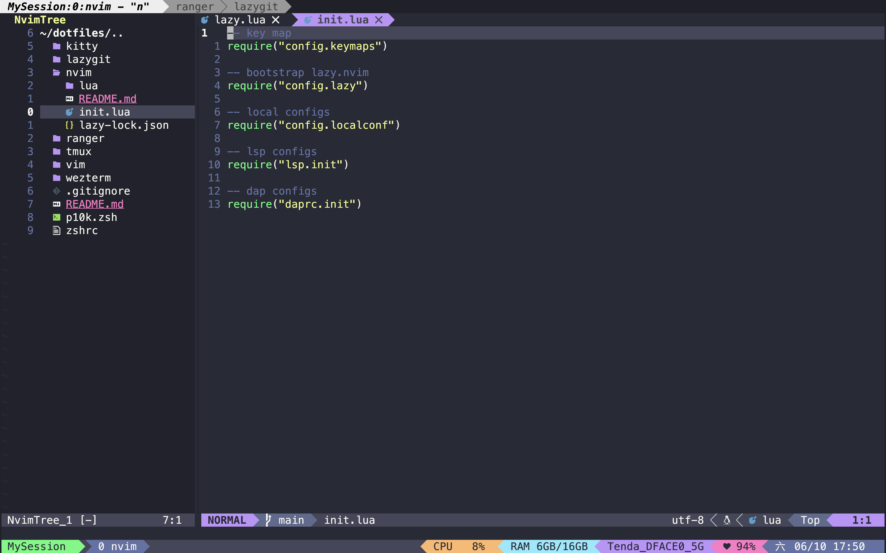

# dotfiles

my dotfiles



# Usage

jsut

```bash
git clone https://github.com/hnpyn/dotfiles.git
```

and

```bash
ln -s [the/dotfiles/you/want] [to/your/configs]
```

for example

```bash
ln -s ~/dotfiles/wezterm ~/.config/wezterm
```
